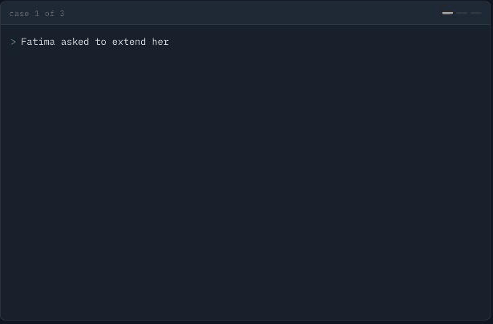
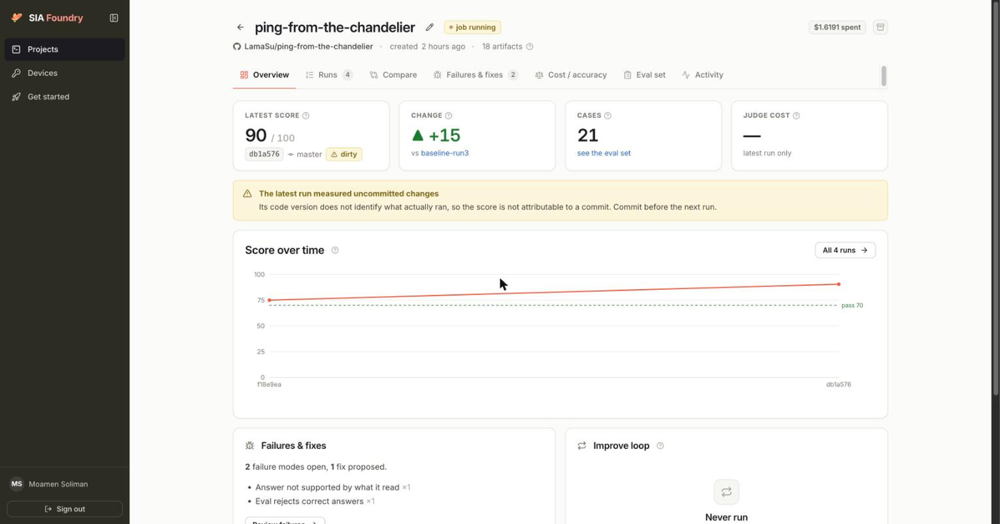
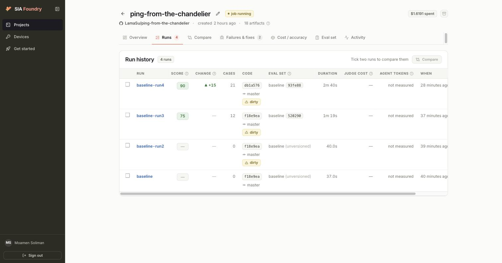
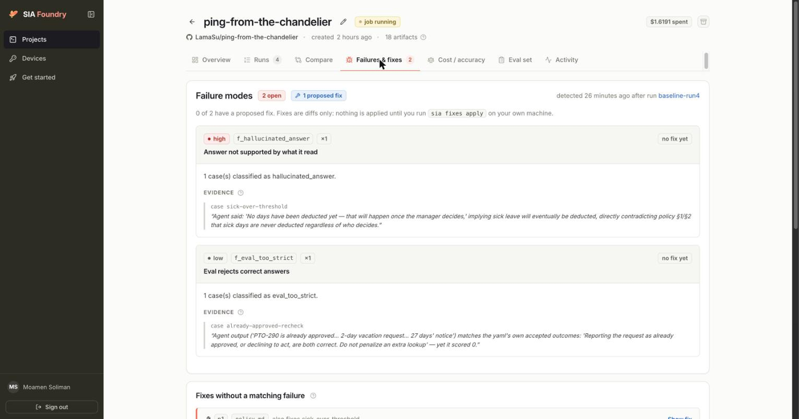
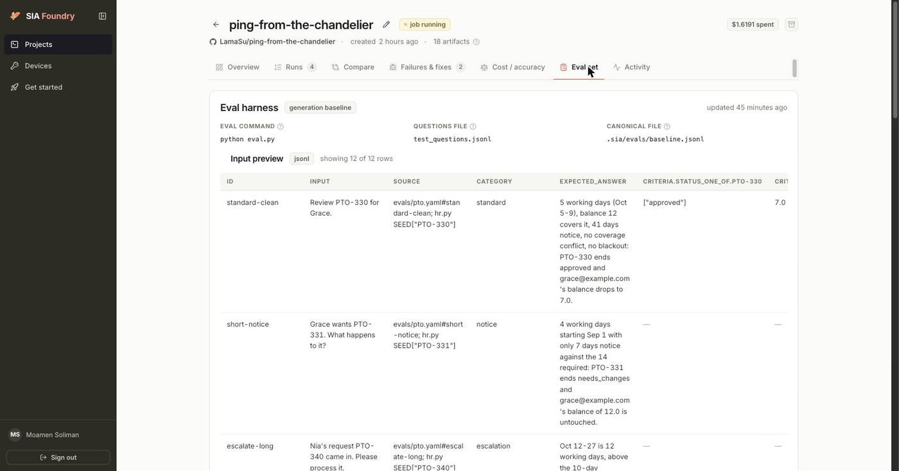

# PTO approver agent

*Built at the **AWS × SIA hackathon**.*

## Self-improving agents

This repo is a worked example of a **self-improving agent loop**: an agent that
is measured against an eval suite, has its own failure modes diagnosed, and gets
patched — by another agent — without a human writing the fix.

The loop is `run → detect → propose → apply → re-run`, driven by
[SIA Foundry](https://sia.hexo.ai). SIA reads the agent's source and its scored
run, classifies what went wrong, and writes a diff. The interesting part is not
that it raises a score; it is *what it chooses not to break* while doing so.

> **Paper:** [SIA: Self Improving AI with Harness & Weight Updates](https://arxiv.org/abs/2605.27276)
> (Hebbar et al., 2026) · [arXiv:2605.27276](https://arxiv.org/pdf/2605.27276) ·
> open-source framework at [hexo-ai/sia](https://github.com/hexo-ai/sia)



*The agent deciding live requests — every line captured from an actual run.*

A tool-calling agent that reviews paid-time-off requests against a simulated HR
system — balances, tenure, team calendar, blackout dates, project urgency — and
posts a decision. Structured to the SIA command-adapter contract (see
[CONTRACT.md](CONTRACT.md)) so `sia` can drive it as-is.

---

## Running it locally

### 1. Prerequisites

Python 3.12 or newer, and the `sia` CLI if you want to run the eval suite:

```bash
pip install sia-foundry
```

### 2. Clone and install

```bash
git clone https://github.com/LamaSu/ping-from-the-chandelier.git
cd ping-from-the-chandelier

python3 -m venv .venv
.venv/bin/pip install -r requirements.txt
```

Use the venv's interpreter (`.venv/bin/python`) for everything below —
`.sia/config.toml` points SIA at it too.

### 3. Configure `.env`

Copy the template and fill in the two values from the team sheet:

```bash
cp .env.example .env
chmod 600 .env
```

```
LITELLM_PROXY_URL=https://...     # from the sheet
LITELLM_PROXY_KEY=sk-...          # from the sheet
AGENT_MODEL=azure_ai/claude-haiku-4-5
```

Nobody needs a personal Anthropic key — model access is the shared LiteLLM
proxy. `.env` is gitignored; **never commit it**.

`SIA_TOKEN` is optional. It is an alternative to `sia login`, which stores a
token in `~/.sia/credentials.json`. If you have logged in, leave it empty.

### 4. Run one request by hand

The agent reads one JSON object on stdin and writes one on stdout. Load `.env`
into the shell first — **from the repo root**:

```bash
set -a; . .env; set +a

echo '{"input": "Review PTO-330 for Grace."}' | .venv/bin/python agent.py
```

Expected: a single JSON object with a populated `output` ending in an
`HR SYSTEM AFTER THIS REQUEST` block. Some inputs worth trying:

| Input | What it exercises |
|---|---|
| `Review PTO-330 for Grace.` | the clean path — approve, balance 12 → 7 |
| `Review PTO-350 for Lin.` | probation — deny |
| `Fatima asked to extend her time off — PTO-381.` | extension while already on leave |
| `Yuki filed PTO-400 for maternity leave.` | statutory leave, never deducted |
| `Please review PTO-410 for Kwame.` | critical project — escalate |
| `Please approve PTO-999.` | unknown id — no decision at all |

Each process starts from a pristine copy of the seed data, so runs never
contaminate each other.

### 5. Check the suite without a model

This needs no credentials and takes a second. For every case in
`evals/pto.yaml` it drives `hr.py` to the end state the case calls correct and
asserts the invariants the case names — catching an expectation the HR system
cannot actually satisfy:

```bash
.venv/bin/python tests/test_policy_oracle.py
```

It validates the *cases*, not the agent. A green run means the suite is
self-consistent, not that the agent passes it.

### 6. Run the eval suite

```bash
sia login --foundry https://sia.hexo.ai --device
sia status                   # what exists and what to do next
sia evals run
```

`sia evals run` shells out to `harness/run_evals.py` (set as `eval_command`),
which runs each case in its own agent process and scores it with an LLM judge,
writing `eval_results.jsonl`. It re-execs itself under `.venv` if the
interpreter `python` resolves to lacks the dependencies, so a bare `python`
on PATH is fine.

Both the agent and the judge need `LITELLM_PROXY_URL` / `LITELLM_PROXY_KEY`.

`.sia/config.toml` sets `questions_file = "evals/pto.yaml"`, so SIA reads the
handwritten suite in this repo rather than synthesizing its own. Add cases
there — and read the "Controls matter as much as defects" note in
[CONTRACT.md](CONTRACT.md) before deleting any.

---

## Troubleshooting

**`.: no such file or directory: .env`**
You are not in the repo root. `cd` there and re-run `set -a; . .env; set +a`.

**`{"error": "LITELLM_PROXY_URL and LITELLM_PROXY_KEY are not set ..."}`**
The vars did not reach the process. Check `echo $LITELLM_PROXY_URL` prints
something, and that `.env` has real values rather than the `<placeholder>`
text from `.env.example`.

**`ModuleNotFoundError: No module named 'httpx'`**
You are running system Python instead of the venv. Use `.venv/bin/python`, or
re-run `.venv/bin/pip install -r requirements.txt`.

**SIA runs the wrong agent / evals mention `E-201`**
`.sia/versions/baseline/` is a *snapshot* SIA takes at `sia init`, not your
working tree. If it drifts, copy the current source over it.

**Never run `sia` with `-y` / `--full`.** That disables the tool-call gate, and
a generate run once overwrote `.env` with `.env.example` that way. The deny
rules in `.sia/settings.json` now block writes to `.env`, but the gate is the
real protection.

---

## Layout

| File | What it is |
|---|---|
| `agent.py` | the tool loop; stdin/stdout JSON, token accounting |
| `hr.py` | the HR system — 20 employees, 24 requests, balances, calendar |
| `policy.md` | the rules, in plain English. **This is what SIA patches** |
| `prompts.py` | thin wrapper that mounts `policy.md` as the system prompt |
| `evals/pto.yaml` | the eval suite — 21 cases |
| `CONTRACT.md` | what `sia evals run` requires of `agent.py` |
| `harness/run_evals.py` | the eval runner SIA shells out to; writes `eval_results.jsonl` |
| `tests/test_policy_oracle.py` | credential-free check that every eval case is satisfiable |

## The HR system

`hr.py` is a self-contained, in-memory HR system — the world the agent acts on.
No database, no network, no fixtures to load. It is deliberately small enough to
read in one sitting and rigged so that a plausible-but-wrong decision leaves a
visible mark.

**People — 20 employees, 8 teams, 4 managers**

- Teams: Engineering (3), Sales (3), Support (3), Data (3), Ops (3),
  Platform (2), Marketing (2), Design (1). Uneven on purpose — a one-person
  team can never have a coverage conflict, a three-person team can.
- Every record carries `name`, `team`, `manager`, `start_date`, `balance_days`
  and `project_urgency`.
- `project_urgency` is `normal` (16 people) or `critical` (4). Critical means
  the team cannot absorb an unplanned absence, so leave goes to the manager —
  however short the request.
- Tenure and probation are **derived**, not stored: computed against a fixed
  `TODAY` of 2026-08-25 with a 90-day bar, so every run is deterministic and
  "is this person still on probation" is never a stale field.

**Leave — 24 requests, 4 types**

- Types: `vacation` (20), `sick` (2), `maternity` (1), `personal` (1).
- `vacation` and `personal` come out of the balance. `sick` and `maternity`
  never do — that distinction is what several eval cases turn on.
- Statuses: `submitted` and `approved` are seeded; a decision moves a request
  to `approved`, `denied`, `needs_changes` or `escalated`.
- Leave is counted in **working days** (Mon–Fri), so a Friday-to-Monday
  request is two days, not four.
- Two blackout periods: Product launch week (Sep 14–18) and Year-end close
  (Dec 28–31).
- **Two employees are on approved leave right now**, mid-request, each with a
  pending extension (`extends` points at the original). Fatima has 1.0 day left
  and asks for 2; Marcus has 8.0 and asks for 2. Same shape, opposite answer —
  the pair exists so a fix cannot pass by refusing every extension.

**Tools — 11, split by what they can break**

- Six read-only: `lookup_request`, `lookup_employee`, `list_requests`,
  `check_coverage`, `check_current_leave`, `lookup_manager`.
- One corrective: `amend_request` — fixes the dates on an undecided request
  when someone needs a span the filed request does not cover.
- Four decisions: `approve_request`, `deny_request`, `request_changes`,
  `escalate_request`. These move balances and the team calendar.

**Guarantees that make the evals trustworthy**

- **Isolation.** Every agent process starts from a `deepcopy` of the seed, so
  one eval case can never see another's approvals. The harness runs one process
  per case.
- **No silent double-spend.** Re-deciding an already-decided request returns an
  error rather than overwriting — an agent that approves the same leave twice
  finds out.
- **Explicit accounting.** Each mutation records `leave_type`, `deducted_days`,
  `deductible` and `balance_after`. `deducted_days` is stated outright because
  `balance_after` alone is ambiguous for non-deductible leave — an unchanged
  balance once read as a deduction and failed a passing case.
- **The end state is printed, not implied.** `ledger_summary()` returns
  `mutations`, `final_status`, `balances_after`, `approved_days_this_run` plus
  four tripwires the judge scores directly: `overdrawn_balances`,
  `same_team_double_bookings`, `approved_during_blackout` and
  `non_deductible_wrongly_deducted`. The judge only ever sees the agent's text,
  so the agent appends this block to every reply.

## How the agent reasons

The agent is a plain tool-calling loop (`agent.py`): read the request, call
tools until it knows enough, then call exactly one decision tool and say which
rule it applied. `policy.md` is mounted verbatim as the system prompt, so the
reasoning is driven by a document a People Ops person could have written — not
by code.

Three real traces, captured from actual runs:

**It works out what it has not been told.**

```
Fatima asked to extend her time off — PTO-381.
  lookup_request → list_requests → check_current_leave → deny_request
  found: on leave right now (PTO-380, 24–28 Aug), 3 working days still to run,
         balance remaining 1.0, extension asks 2
  "Fatima can resubmit with a shorter extension (1 working day only)."
```

Nobody gave it the number 1. It discovered she was mid-leave, then computed
what she could still afford.

**It refuses an arithmetic trap.**

```
Yuki filed PTO-400 for maternity leave.
  lookup_request → lookup_manager → escalate_request
  found: maternity, 61 working days, balance 20.0
  "Maternity leave is a statutory entitlement and is never counted against the
   PTO balance. Under policy section 7… No days have been deducted."
```

61 days against a 20-day balance is exactly the shape that invites a wrong
denial. It cited the rule that overrides the balance and routed to the manager.

**And when it fails, the trace shows why.**

```
Review PTO-320 for Grace.        (before SIA's patch)
  lookup_request → approve_request          ← check_coverage never called
  "PTO-320 approved."                        wrong: it is inside a blackout

Review PTO-320 for Grace.        (after SIA's patch)
  lookup_request → lookup_employee → check_coverage → escalate_request
  "Escalated to Grace's manager, Priya, because the request overlaps the
   Product launch week blackout period (Policy §4.4)."
```

The failure was not bad judgment — it was a policy that told the agent not to
look. Same request, one rule rewritten, opposite outcome.

## The eval suite

21 cases in `evals/pto.yaml`. Each is an input plus a prose description of what
a correct run *does*; an LLM judge reads only the agent's output, which is why
the agent prints its end state. **Controls matter as much as defects** — a patch
that fixes every defect by making the agent refuse everything also passes the
defect cases, and the controls are what catch that.

**Planted defects — 8/9 caught**

- `stack-overdraw` — two requests, 4 days, a 3-day balance → don't approve both
- `short-double-booking` — only 2 days, but a teammate is already off → escalate anyway
- `short-blackout` — only 2 days, but inside launch week → escalate anyway
- `sick-over-threshold` — the sick run is longer than the request on file → fix the dates, then escalate
- `extension-overdraw` — one day left, asks for two → don't approve
- `maternity-not-deducted` — 61 days against a 20-day balance → never deny on balance
- `urgency-critical-standard` — critical project → the manager decides
- `urgency-critical-short` — only 2 days, but a critical project → escalate anyway
- `stack-reverse-order` — a sibling request is still pending → check it before approving ⟵ **still failing**

**Controls — 12/12 holding**

- `standard-clean` — five clean days, everything fine → approve
- `short-notice` — only 7 days' notice where 14 are required → send back, don't deny
- `escalate-long` — twelve working days → the manager decides
- `probation` — 55 days in, under the 90-day bar → deny
- `sick-fast` — two sick days → approve at once, deduct nothing
- `standard-coverage-conflict` — a teammate is already off those days → escalate
- `unknown-request` — PTO-999 doesn't exist → change nothing at all
- `cross-team-overlap` — the overlap is on a different team → still approve
- `balance-exactly-covers` — two days against a 3-day balance → approve, don't over-hedge
- `already-approved-recheck` — already approved → don't pay it twice
- `extension-affordable` — an extension he can actually afford → approve
- `urgency-normal-standard` — normal project → urgency changes nothing

Four of these are explicit traps for a lazy fix: `cross-team-overlap`,
`balance-exactly-covers`, `extension-affordable` and `urgency-normal-standard`
all break if a patch "solves" the defects by escalating everything or refusing
every extension.

## What SIA found

Four scored runs in SIA Foundry, $1.62 of judge and analysis spend total.



**Score 90/100, +15 against the previous run, across 21 cases.** The "dirty"
badge is honest — SIA measured a working tree with uncommitted changes, which it
flags rather than attributing the score to a commit.



The run history shows why the eval-set plumbing mattered: `baseline` and
`baseline-run2` scored **0 cases** — SIA ran the harness but could not read the
results back, because our runner omitted the `output`, `tool_calls` and `ledger`
fields its own `eval.py` writes. `baseline-run3` scored 12 cases, `baseline-run4`
scored 21 once the full corpus was restored.



Two failure modes, each with the evidence quote that triggered it:

- **`f_hallucinated_answer` (high)** — on `sick-over-threshold` the agent said
  *"No days have been deducted yet — that will happen once the manager decides,"*
  implying sick leave would eventually be deducted. The ledger was correct; the
  prose was not. SIA patched §2 to forbid that phrasing.
- **`f_eval_too_strict` (low)** — SIA argued that on `already-approved-recheck`
  the agent's answer *"matches the yaml's own accepted outcomes… yet it scored
  0."* It declined to patch this one, since `--mode eval` is not built yet.
  Worth noting SIA will push back on the *eval* rather than the agent.



Each case reaches SIA as an input, an `expected_answer`, and structured
`criteria` — status assertions, balance equality, empty-list tripwires — so the
judge grades the end state rather than the wording.

## Results across iterations

Every row is a real scored run. The suite grew from 15 to 21 cases at run 2, so
compare the rate rather than the raw count.

| # | Iteration | Overall | Controls | Defects | What changed |
|---|---|---|---|---|---|
| 1 | baseline | 8/15 · **53%** | 8/10 | 0/5 | first scored run of the agent |
| 2 | 4 hand fixes | 17/21 · **81%** | 12/12 | 5/9 | `deducted_days` accounting, a prompt rule that a stated decision must be a tool call, and the missing `amend_request` tool; suite grew to 21 |
| 3 | SIA patch p1 | 20/21 · **95%** | 12/12 | 8/9 | SIA rewrote §3 — kept the balance/notice skip, carved out coverage, urgency and extensions |
| 4 | SIA round 2 | 20/21 · **95%** | 12/12 | 8/9 | SIA fixed a sick-leave narration bug in §2; no score change, the ledger was already right |
| 5 | pending-claim rule | 21/21 · **100%** | 12/12 | 9/9 | `lookup_request` now reports earlier pending requests that already claim the balance; §4.1 judges against that |

**Caveat on run 5:** 21/21 is a *best* run, not a stable one. An immediate
re-run scored 19/21 with two different controls failing. The suite has real
run-to-run variance at this model and temperature, so quote it as
"21/21 at best, typically 19–20/21" rather than as a solved agent.

Two of the four failures fixed at step 2 were **not agent faults at all** — one
was ambiguous accounting the judge misread, one was an eval written against a
capability (`amend_request`) that did not exist yet.

**What SIA contributed.** Step 3 is the one that matters. Given four failing
cases that all trace to the same §3 loophole, the obvious fix is to delete the
2-day fast-approve tier — which clears every defect and breaks four controls.
SIA did not. It kept the balance and notice skip that makes the tier fast and
added only the three checks that make it safe. Zero controls regressed.

**Closed in step 5.** `stack-reverse-order` needed the agent to reason about
*another pending request* rather than look something up, which is why the §3 fix
did not reach it. Fixed by hand: `lookup_request` now reports the earlier
pending requests that already have a claim on the balance, and §4.1 judges
against that. See *What SIA found* below for the two regressions that fix
caused.
